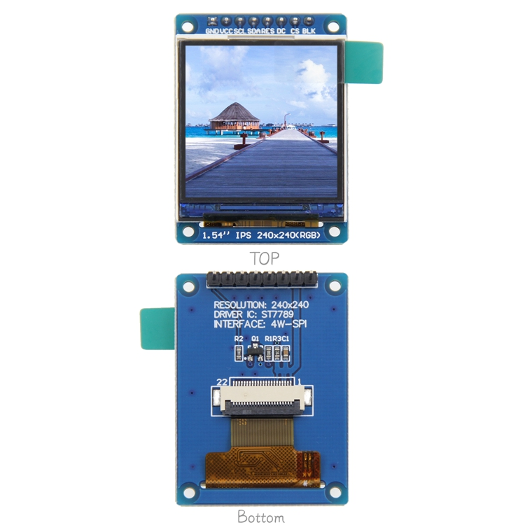
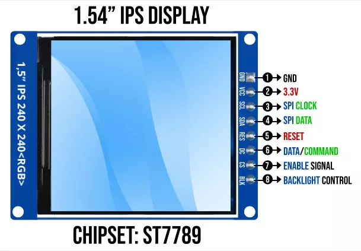

# 1.54英寸IPS显示模块

## 概述
1.54英寸IPS显示模块是一款高性能的TFT液晶显示屏，专为嵌入式系统设计，广泛应用于智能手表、可穿戴设备及消费电子产品。该模块具备RGB 65K色彩显示，能够提供丰富的视觉体验，且拥有全视角显示能力，确保在不同观看角度下图像依然清晰可见。

## 核心特点
- **高分辨率**：240x240像素的显示分辨率，确保图像和文本清晰锐利。
- **全视角能力**：采用IPS技术，有效提升观看角度，极大改善色彩的一致性和亮度。
- **简便的接口**：通过4线制SPI接口连接，简化了硬件连接过程，适配多种控制器。
- **兼容性**：模块与多种微控制器兼容，包括Arduino、STM32、C51等，可用于广泛的应用场景。
- **结构紧凑**：模块尺寸为1.54英寸，适合嵌入各种空间受限的设备。

## 产品参数

| **参数名**                | **参数值**                              |
|---------------------------|-----------------------------------------|
| **显示颜色**              | RGB 65K 彩色                            |
| **SKU**                   | MD0757                                 |
| **尺寸**                  | 1.54 英寸                               |
| **面板材质**              | TFT                                     |
| **驱动芯片**              | ST7789                                  |
| **分辨率**                | 240 x 240 像素                         |
| **有效显示区域**          | 27.72 x 27.72 mm                       |
| **触摸屏类型**            | 无触摸屏                                |
| **工作温度**              | -10℃ ~ 60℃                            |
| **存储温度**              | -20℃ ~ 70℃                            |
| **工作电压**              | 3.3V                                    |
| **产品重量**              | 10g（含包装）                           |

## 接口定义

| **序号** | **模块引脚** | **引脚说明**                          |
|----------|--------------|---------------------------------------|
| 1        | GND          | 液晶屏电源地（接地）                  |
| 2        | VCC          | 液晶屏电源正 (3.3V)                   |
| 3        | SCL          | SPI总线时钟信号                        |
| 4        | SDA          | SPI数据写入信号                        |
| 5        | RES          | 复位控制信号（低电平复位）              |
| 6        | DC           | 数据/寄存器选择信号（低电平为寄存器，高电平为数据） |
| 7        | CS           | 片选控制信号（低电平使能）              |
| 8        | BLK          | 背光控制信号（高电平点亮）             |

## 应用场景
1. **智能手表**：用于显示时间、健康数据和通知等信息。
2. **可穿戴设备**：在医疗和运动设备中显示实时数据。
3. **消费电子产品**：如迷你游戏机或智能家居控制面板上进行信息反馈。

